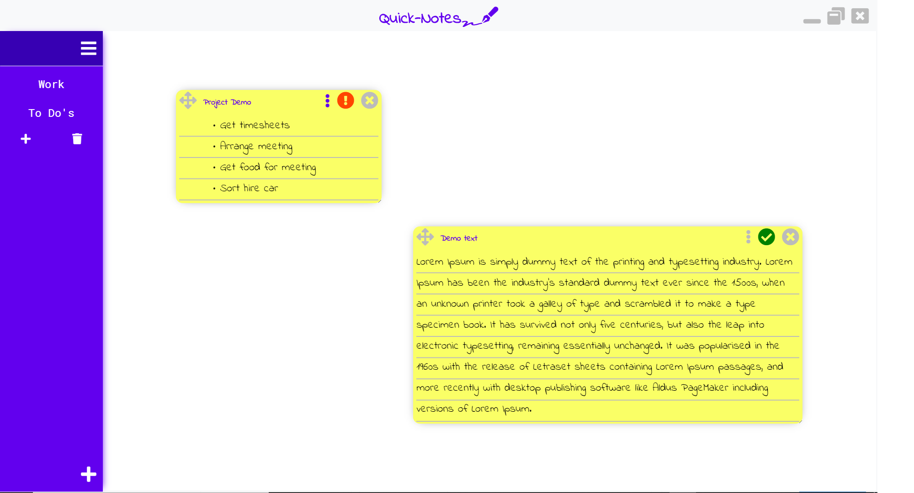

# Quick Notes

# Summary
A quick note taking app. Lets you store notes in groups, give notes titles and prioritises.
# Getting Started
There are two ways you can get the application.
* Download the application from the [windows store.](https://www.microsoft.com/store/apps/9NVNKR8W8K6C)
* Download the application from the release section, unzip and run the QuickNotes.exe
* Download the project source code and build it yourself. Run npm package-app-64 in your console for a x64 build.

# Versions
## V1.0.2

* Quick Note taking
* Auto-save
* Group notes into categories
* Drag and place notes.
* Bullet point lists
* Priority Notes
